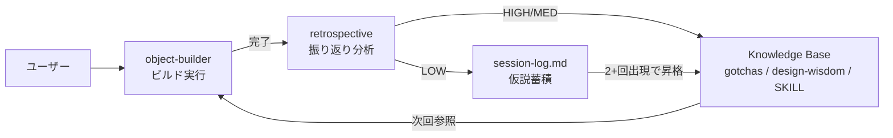
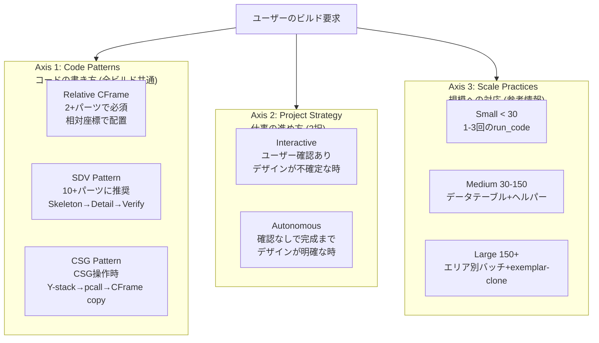
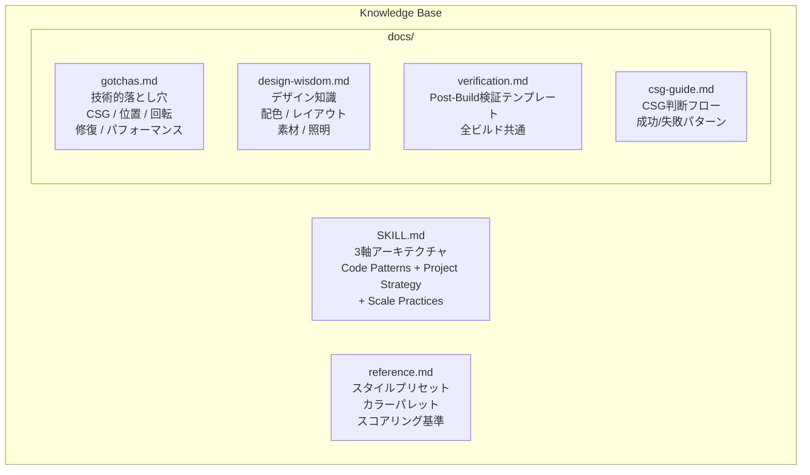
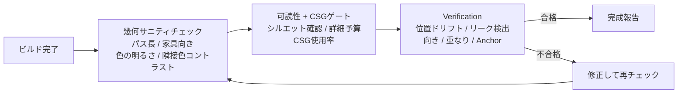
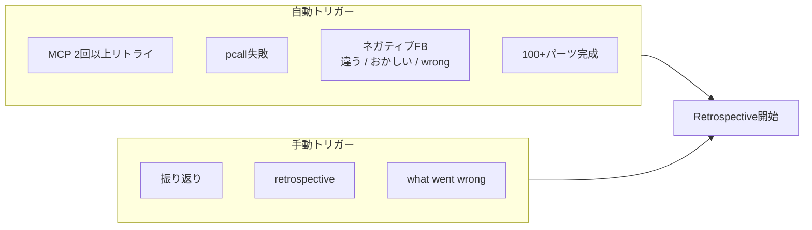
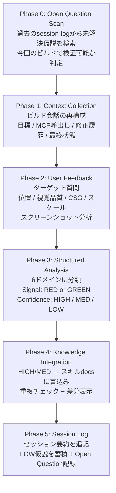
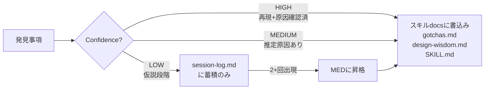

# Roblox Build Skills アーキテクチャ概要

2つのスキル (`roblox-object-builder` と `roblox-build-retrospective`) の構造と連携を解説する。

---

## 全体像: 自己改善ループ

2つのスキルは独立して動くのではなく、**使うほど賢くなる閉ループ**を構成している。



- **object-builder** がナレッジベースのルールに従ってビルドを実行
- **retrospective** が各ビルドの結果を分析し、ナレッジベースそのものを更新
- 次回ビルド時には更新済みルールが適用される

---

## 1. roblox-object-builder

AIがRoblox Studio内に3Dオブジェクトやマップを構築するためのスキル。

### 1.1 MCP ツール (2つのみ)

| ツール | 用途 |
|--------|------|
| `run_code` | Luaコードを実行してパーツ作成・CSG・検証 |
| `insert_model` | マーケットプレイスからモデル挿入 |

### 1.2 3軸アーキテクチャ

object-builder は3つの独立した軸で構成されている。
旧アーキテクチャでは「Build Modes」として1軸に束ねられていた関心事を分離した。



**なぜ3軸か:** 旧「Build Modes」は規模に応じて Object / Hybrid / Map の3択だったが、
実際にはコードパターン・インタラクション・スケール対応は独立した関心事。
Hybridのanchor+相対CFrameパターンは30パーツのゲートにも200パーツのロビー内プロップにも有効だが、
旧構造では「Hybrid Mode (20-150パーツ)」に閉じ込められていた。

#### Axis 1: Code Patterns (全ビルド共通)

| パターン | 適用条件 | 核心ルール |
|---------|---------|-----------|
| **Relative CFrame** | 2+パーツの関連オブジェクト全て | `parent.CFrame * CFrame.new(offset)` で相対配置。絶対座標禁止 |
| **SDV (Skeleton-Detail-Verify)** | 10+パーツの複合オブジェクトに推奨 | Phase 1: アンカー配置 → Phase 2: FindFirstChild+相対配置 → Phase 3: 自動検証 |
| **CSG Pattern** | CSG操作を含むビルド | Y-stackプラン → pcall+TriangleCount → CFrameコピー → UsePartColor |

SDV Pattern は旧 Hybrid 3-Phase Mode と同一内容。「モード」から「パターン」に昇格し、全ビルドで使用可能になった。

5ラウンドのA/Bテストで検証済み:

| アプローチ | 空間精度 | 詳細深度 | 向き精度 |
|-----------|---------|---------|---------|
| OneShot (1回) | 最高 (4.75/5) | 浅い (3/5) | 不安定 |
| Stepwise (6+回) | 最低 (3.75/5) | 深い (3.8/5) | 不安定 |
| **SDV** | **良好 (4.38/5)** | **良好 (4/5)** | **唯一ゼロエラー達成** |

#### Axis 2: Project Strategy (ユーザー意図で選択)

| 戦略 | いつ使う | 特徴 |
|------|---------|------|
| **Interactive** | デザインが不確定、ユーザーが反復したい | ステップごとに確認。視覚FBを得てから次へ |
| **Autonomous** | デザインが明確、完成品がほしい | 事前にデザイン宣言。中断なしで完成まで進む |

両戦略とも**同じCode Patternsを使う**。違うのはユーザーとの対話頻度だけ。

#### Axis 3: Scale Practices (規模別の補助ガイダンス)

| 規模 | パーツ目安 | 追加プラクティス |
|------|----------|----------------|
| Small | < ~30 | 1-3回のrun_codeで十分。SDVは任意だが推奨 |
| Medium | ~30-150 | SDV強く推奨。データテーブル+ヘルパー。サブフォルダ |
| Large | > ~150 | エリア別バッチ。exemplar-then-clone。均一品質監査。パフォーマンス予算 |

### 1.3 ナレッジベース (6ファイル)



各ファイルの役割:

| ファイル | 内容 | 参照タイミング |
|---------|------|--------------|
| `SKILL.md` | 3軸アーキテクチャ、Code Patterns、重要Gotchas | 毎回 |
| `reference.md` | スタイルプリセット、パレット、スコアリング | スタイル重視ビルド前 |
| `gotchas.md` | 技術的落とし穴 (CSG/位置/回転/修復/パフォーマンス) | デバッグ時・予防参照 |
| `design-wisdom.md` | デザイン知識 (レイアウト/配色/素材/照明) | マップ/シーン設計時 |
| `verification.md` | Post-Build検証テンプレートコード | 全ビルドの完了前 |
| `csg-guide.md` | CSG判断フロー、成功/失敗パターン | CSG操作実行時 |

### 1.4 Post-Build Gate (全ビルド共通)



### 1.5 主要なGotchas (頻出バグのトップ5)

1. **Cylinder長軸 = X**: `Size.X` が長さ。直立させるには `CFrame.Angles(0, 0, math.pi/2)`
2. **Part.Position = バウンディングボックス中心**: 床をY=0に置くには `Position.Y = Size.Y / 2`
3. **CSGサイレント失敗**: `UnionAsync`/`SubtractAsync` がエラーなしで空メッシュを返す → pcall + TriangleCount > 0 チェック必須
4. **CSG結果のCFrame回転消失**: `result.CFrame = CFrame.new(x,y,z)` で回転が消える → `result.CFrame = originalPart.CFrame` を使う
5. **子パーツのワールド座標ハードコード**: 親が動くと子がズレる → `child.CFrame = parent.CFrame * CFrame.new(localOffset)` で相対計算

---

## 2. roblox-build-retrospective

ビルドセッション後に「何がうまくいき、何が失敗したか」を分析し、学びを object-builder のナレッジベースに書き戻す**自己改善エンジン**。

### 2.1 トリガー条件



### 2.2 5フェーズのプロセス



#### 各フェーズの詳細

| Phase | 目的 | 入力 | 出力 |
|-------|------|------|------|
| 0 | 過去の未解決仮説を検索 | session-log.md | 検証対象リスト |
| 1 | ビルド会話の再構成 | 会話履歴 | 構造化されたビルドサマリ |
| 2 | ユーザーからの視覚的FB | 質問チェックリスト / スクリーンショット | 問題点リスト |
| 3 | 発見事項の構造化分析 | Phase 1-2の情報 | ドメイン別findings (Signal + Confidence付き) |
| 4 | ナレッジベースへの書込み | HIGH/MED findings | gotchas.md / design-wisdom.md / SKILL.md の更新 |
| 5 | セッション記録 | 全findings | session-log.md への追記 |

#### 分析の6ドメイン

| ドメイン | 内容 | 書込み先 |
|---------|------|---------|
| Geometry | 位置、サイズ、回転の問題 | gotchas.md |
| CSG | Union/Subtract失敗、メッシュ品質 | gotchas.md |
| Materials | 色、素材、Neon、透明度 | design-wisdom.md |
| Design | レイアウト、プロポーション、美観 | design-wisdom.md |
| Process | ワークフロー順序、検証漏れ | SKILL.md |
| Performance | パーツ数、レンダリングコスト | gotchas.md |

### 2.3 信頼度ゲーティング (品質保護の核心)



LOW confidence の仮説をスキルdocsに書き込まないことで、推測に基づく不正確なルールがビルド品質を低下させることを防ぐ。

### 2.4 メタ分析 (3+セッション蓄積後)

| 分析項目 | 目的 |
|---------|------|
| 頻度分析 | どのドメインに最もfindingsが多いか → 注力すべき領域の特定 |
| LOW仮説の昇格 | 2回以上出現した仮説をMEDに昇格してdocsに書込み |
| 矛盾検出 | セッション間で矛盾する知見がないかチェック |
| 肥大化チェック | docsが300行超 → 再編成または新ファイル抽出 |
| 陳腐化検出 | `last-validated`が古いエントリを報告 (自動削除はしない) |

### 2.5 セッションログの構造

```markdown
## [日付] - [オブジェクト名]

**Goal:** 何を作ったか
**Outcome:** SUCCESS / PARTIAL / FAILURE
**Key findings:**
- [Finding - ドメイン - Signal - Confidence]
**Skill updates made:**
- `gotchas.md`: 何を追加/更新したか
- `design-wisdom.md`: 何を追加/更新したか
**Open question resolution:** (Phase 0で検証した過去の仮説の結果)
**Open questions:** (LOW confidence の新しい仮説)
```

現在10セッション分の振り返りが蓄積済み。

---

## 3. ファイル構成まとめ

```
.claude/skills/
├── roblox-object-builder/          ← ビルド実行スキル
│   ├── SKILL.md                    ← 3軸アーキテクチャ (毎回読込)
│   ├── reference.md                ← スタイルプリセット (スタイル重視ビルド前)
│   └── docs/
│       ├── gotchas.md              ← 技術的落とし穴 (retrospectiveが更新)
│       ├── design-wisdom.md        ← デザイン知識 (retrospectiveが更新)
│       ├── verification.md         ← Post-Build検証テンプレート (全ビルド共通)
│       └── csg-guide.md            ← CSG判断フロー
│
└── roblox-build-retrospective/     ← 振り返り分析スキル
    ├── SKILL.md                    ← 5フェーズプロセス定義
    └── knowledge/
        └── session-log.md          ← セッション履歴 + LOW仮説蓄積
```

### データフローの方向

```
object-builder の docs ←──(書込み)── retrospective
                                          ↑
                                     (読取り)
                                          │
                              session-log.md ←──(蓄積)── 各ビルドセッション
```

**retrospective は object-builder のドキュメントを直接編集する。** 逆方向の依存はない。object-builder は retrospective の存在を知らず、自分のdocsだけを参照してビルドする。この一方向の依存関係がアーキテクチャをシンプルに保っている。
